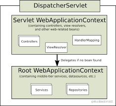

# spring_web_annotation

## ServletContainerInitializer
1. Servlet 容器在啟動時會掃描，當前專案中的所有(包含  Jar 檔內) ServletContainerInitializer 的實作
2. 實作設定檔必須放置在 META-INF/services/ 且名稱必須為 javax.servlet.ServletContainerInitializer 名稱

## SpringServletContainerInitializer

1. Web 應用啟動時會掃描，當前專案中的所有(包含  Jar 檔內) ServletContainerInitializer 的實作
2. 讀取 META-INF/services/javax.servlet.ServletContainerInitializer 檔案設定的 ServletContainerInitializer
3. Spring Web 啟動時會透過 SpringServletContainerInitializer 初始化一些 Servlet 及物件
4. 並且建立 WebApplicationInitializer 物件
   1. AbstractContextLoaderInitializer，建立 root 容器(createRootApplicationContext())
   2. AbstractDispatcherServletInitializer
      1. 建立 Web IoC 容器(createServletApplicationContext())
      2. 建立 DispatcherServlet(createDispatcherServlet())
      3. 建立 DispatcherServlet 加入 ServletContext (getServletMappings)
   3. AbstractAnnotationConfigDispatcherServletInitializer 註解設定的初始化器
      1. 建立 root 容器 (createServletApplicationContext())
         - getRootConfigClasses(); 傳入設定物件
      2. 建立 Web IoC 容器 (createRootApplicationContext())
         - 獲得設定物件 getServletConfigClasses()

## 自訂 SpringMVC 設定檔
1. @EnableWebMvc 開啟 SpringMVC 自訂功能
2. 設定物件(視圖解析器、試圖路徑對應、靜態資源對應、攔截器、...)